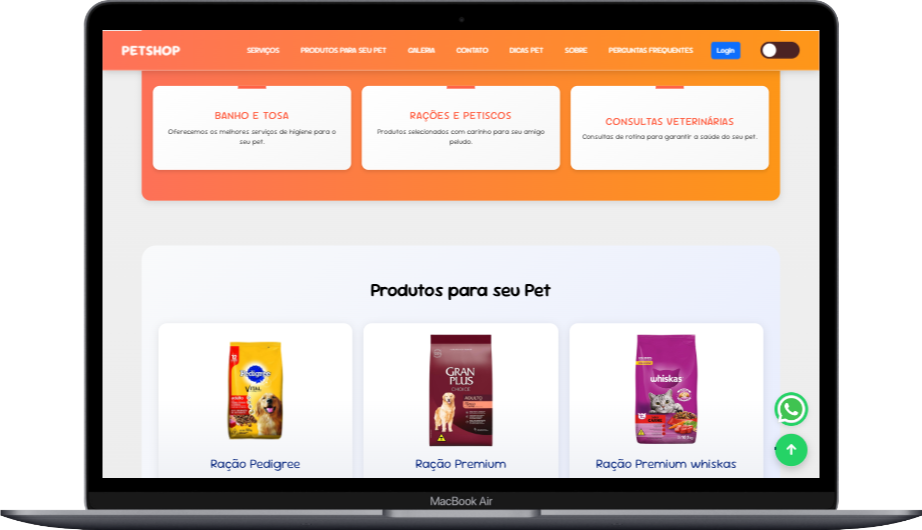

# PetShop - Página Web para Loja de Pet

Este projeto consiste em uma página web para um **PetShop**, onde os usuários podem navegar por diferentes seções, incluindo **Serviços**, **Produtos**, **Galeria** e **Contato**, além de poder realizar o login ou criar uma conta. A página foi construída utilizando **HTML**, **CSS** e **Bootstrap** para o design responsivo.

## Sumário

- [Visão Geral](#visão-geral)
- [Tecnologias Utilizadas](#tecnologias-utilizadas)
- [Estrutura do Projeto](#estrutura-do-projeto)
- [Funcionalidades](#funcionalidades)
- [Checkpoints do Projeto](#checkpoints-do-projeto)

## Visão Geral

Este é um template de site de pet shop onde os usuários podem visualizar serviços oferecidos pelo estabelecimento, produtos para seus pets, e acessar um formulário para login ou criação de conta.

A página tem as seguintes funcionalidades:

- **Navegação intuitiva** com links para as diferentes seções do site.
- **Login/Criação de Conta** com modais de navegação entre as duas opções.
- **Modo Escuro** para melhorar a experiência do usuário em diferentes condições de luz.
- Seção de **Serviços** com informações sobre os serviços oferecidos ao pet.
- Seção de **Produtos** com produtos para pets, com opção para "Adicionar ao Carrinho" (simulado).

## Tecnologias Utilizadas

- **HTML5**: Estrutura do conteúdo da página.
- **CSS** (customizado e Bootstrap): Estilização e layout responsivo.
- **Bootstrap 5**: Framework para garantir que o site seja responsivo e tenha um layout agradável e funcional.
- **Font Awesome**: Ícones utilizados para melhorar a interface de usuário.
- **JavaScript** (caso necessário): Para funcionalidade de modais e interatividade futura.

## Estrutura do Projeto

- **index.html**: Contém o conteúdo HTML da página, incluindo seções de navegação, modal de login, produtos e serviços.
- **style.css**: Arquivo com a estilização customizada da página. Adiciona uma estética visual única e define o modo escuro.
- **img/**: Contém as imagens utilizadas na página, como logotipo, produtos para pets e outros.

## Funcionalidades

1. **Barra de Navegação Fixa**:
   - A barra de navegação permanece fixa no topo da página e permite a navegação entre as seções (Serviços, Produtos, Galeria, Contato, Dicas, Sobre, Perguntas Frequentes).

2. **Modal de Login e Criação de Conta**:
   - O usuário pode acessar um modal para fazer login ou criar uma nova conta. O modal usa abas (`tabs`) para alternar entre as opções.

3. **Modo Escuro**:
   - Um botão para alternar entre o modo claro e escuro, proporcionando uma experiência melhor para o usuário em ambientes com pouca luz.

4. **Seção de Serviços**:
   - Apresentação dos serviços oferecidos pelo PetShop, como Banho e Tosa, Rações e Petiscos, e Consultas Veterinárias.

5. **Seção de Produtos**:
   - Exibe uma lista de produtos para pets, como rações, camas, coleiras e tira-pelos, com preços e descrição, além de um botão para adicionar ao carrinho.

## Checkpoints do Projeto

Aqui estão os principais marcos e tarefas do projeto. 

1. **Estrutura Base**
   - [X] Criar o arquivo `index.html` com a estrutura básica do HTML.
   - [X] Adicionar o título e links externos (Bootstrap, Font Awesome, etc.).
   - [X] Incluir a tag `<meta>` para garantir responsividade.

2. **Navegação**
   - [X] Criar a barra de navegação fixa no topo da página.
   - [X] Adicionar os links para as diferentes seções da página.
   - [X] Implementar a funcionalidade do botão de login (modal).

3. **Modal de Login/Criação de Conta**
   - [X] Criar o modal de login e o formulário para nome de usuário e senha.
   - [X] Implementar o formulário para criação de conta (nome, e-mail, senha).
   - [X] Testar a navegação entre as abas (Login e Criar Conta).

4. **Seção de Serviços**
   - [X] Criar a seção de serviços com 3 serviços principais (Banho e Tosa, Rações e Petiscos, Consultas Veterinárias).
   - [X] Estilizar os cards de serviços para visualização atraente.

5. **Seção de Produtos**
   - [X] Criar a seção de produtos com imagens, nome, preço e descrição.
   - [X] Implementar o botão "Adicionar ao Carrinho" para cada produto.
   - [X] Garantir que a seção de produtos seja responsiva em dispositivos móveis.

6. **Modo Escuro**
   - [X] Implementar a funcionalidade de alternância entre modo claro e modo escuro.
   - [X] Criar a estilização necessária para o modo escuro.

7. **Finalização**
   - [X] Testar o layout em diferentes tamanhos de tela (desktop, tablet, celular).
   - [X] Validar o funcionamento do formulário de login (ou criar interação fictícia com JavaScript).
   - [X] Validar o funcionamento dos botões e links de navegação.
   - [X] Testar o carregamento das imagens (certifique-se de que todas as imagens estão corretamente referenciadas).

8. **Documentação**
   - [X] Criar o arquivo `README.md` detalhando o funcionamento do projeto.
   - [ ] Incluir instruções para instalação e execução.

## Finalização do Projeto

### 1. Teste do Layout em Diferentes Tamanhos de Tela

- **Objetivo**: Testar se o layout é responsivo e se adapta bem a diferentes dispositivos, como **desktop**, **tablet** e **celular**.
  

  
  

  

---

### 4. Teste de Carregamento das Imagens

- **Objetivo**: Verificar se todas as imagens carregam corretamente na página, sem erros de caminho ou de exibição.
  

  
  *Exemplo de imagens carregadas corretamente no site.*

---

### 5. Teste da Funcionalidade do Modo Escuro

- **Objetivo**: Garantir que o botão de alternância entre modo claro e modo escuro esteja funcionando corretamente.

- **Passos**:
  - Clique no botão de modo escuro e verifique se a interface da página muda para o modo escuro, ajustando as cores de fundo e texto.
  - Verifique se a transição é suave e agradável.

- **Imagem**:
  .png)
  *Exemplo da página com o modo escuro ativado.*

---

## Conclusão

Após realizar todos os testes e validar o funcionamento de cada parte do site, o projeto está pronto para ser utilizado. 
